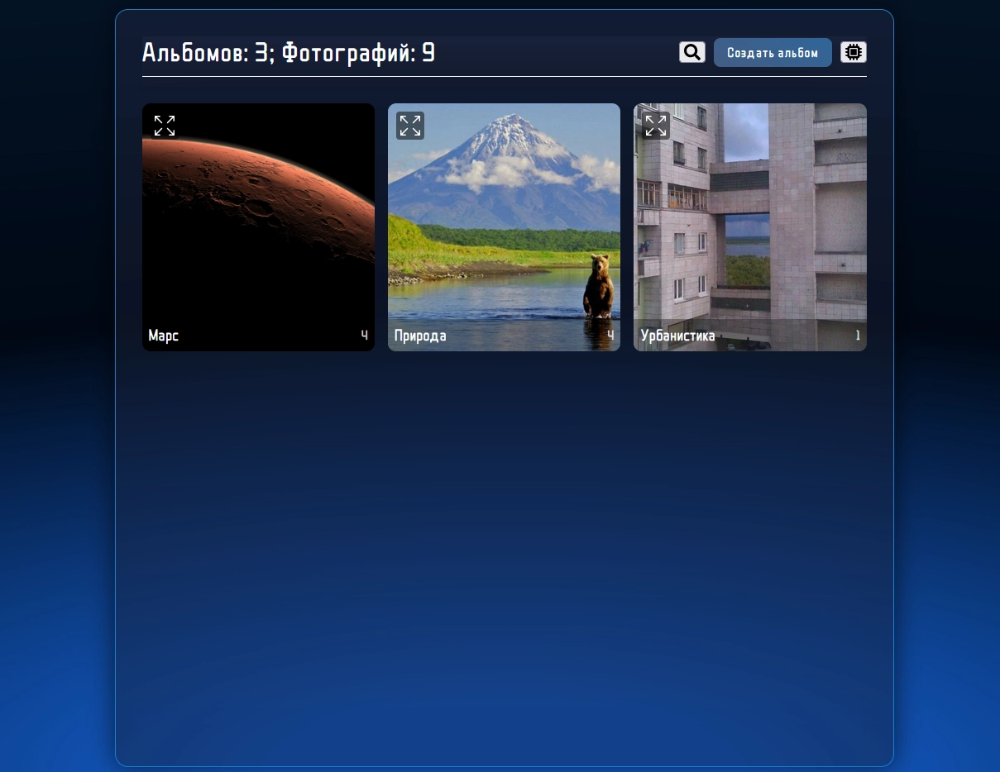
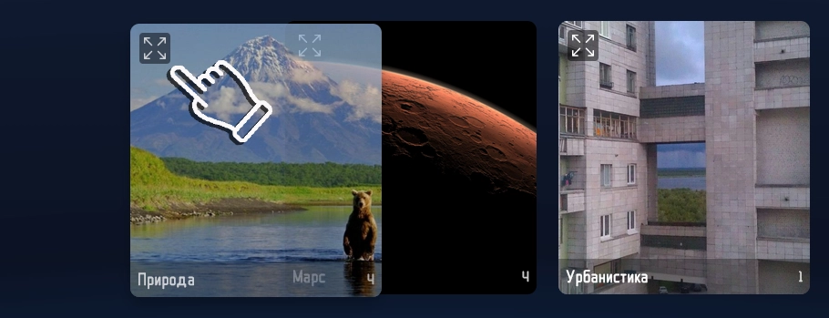
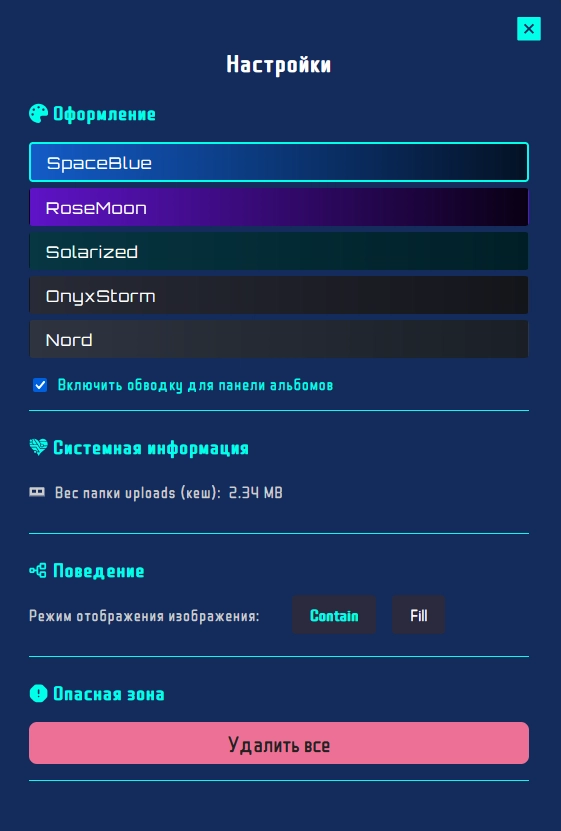
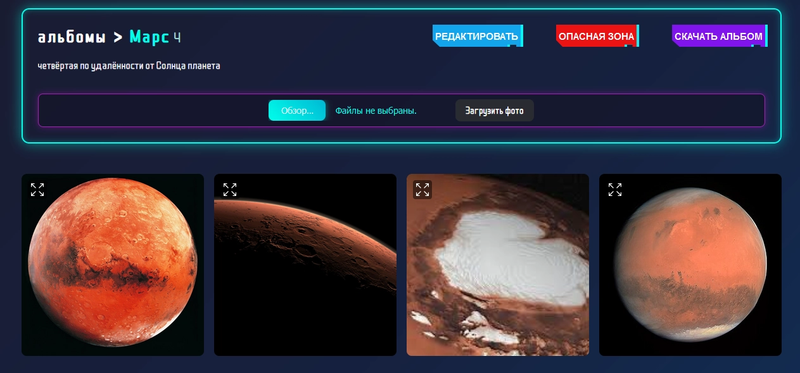
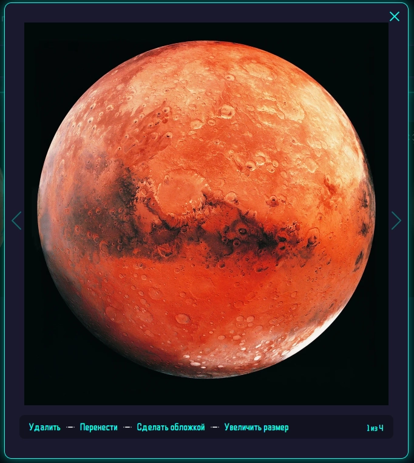

# Phovion

<div align="center">  </div>
<br>

Локальное веб-приложение, разработанное для создания и управления альбомами с фотографиями. Phovion работает прямо в браузере, не требуя серверной инфраструктуры.

# Скриншоты

<!-- <div align="center" style="display: flex; align-items: center;">
  
  
  
  
</div> -->

# Особенности

- Создание альбомов: Легко создавайте и управляйте альбомами для организации ваших фотографий.
- Загрузка фотографий: Добавляйте изображения, включая GIF, прямо через интерфейс или перетаскиванием из других вкладок.
- Сортировка Drag-and-Drop: Интуитивная сортировка альбомов и фотографий с помощью перетаскивания (DND).
- Управляйте интерфейсом клавишами.
- Поддержка GIF: Полная совместимость с анимированными изображениями.
- Кастомизация: Выберите цветовую тему, чтобы настроить внешний вид под свои предпочтения.
- Скачивание: Экспортируйте фотографии из альбома на свой компьютер.

# Стек технологий

<div align="center" style="display: flex; align-items: center;">
  
  <span style="margin: 0 10px; font-size: 24px;"> </span>
  
  <span style="margin: 0 10px; font-size: 24px;"> </span>
  
  <span style="margin: 0 10px; font-size: 24px;"> </span>
  
  <span style="margin: 0 10px; font-size: 24px;"> </span>
  
  <span style="margin: 0 10px; font-size: 24px;"> </span>
</div>

# Особенности сборки

Приложение работает в dev моде, связано это с особенностями работы директории public в next.js в dev и production режимах ([подробнее читать обсуждение](https://github.com/vercel/next.js/discussions/18005))

- Для разработчиков: Если вы хотите попробовать режим production, после добавления новых фото нужно перекомпилировать проект командой npm run build и запустить npm run start. Но для обычного использования достаточно npm run dev.
- Где хранятся фото: Все ваши изображения сохраняются в папке public/uploads на компьютере. Эта папка не затрагивается обновлениями, если вы её не удаляете.
- Удаление изображений происходит из интерфейса приложения, не удаляйте файл напрямую из папки public/uploads !

# Конфиденциальность

Приложение полностью локальное, и работает только на вашем компьютере.
Приложение не собирает и не передает никакие ваши данные или фотографии в интернет. Всё, что вы создаёте — альбомы, фото и настройки, — остаётся исключительно у вас.

# Сборка из исходников

## Структура проекта

- [Структура](https://github.com/Nevionn/Phovion/blob/master/StructureProject.md)

## Зависимости

- Node.js: v18.x или выше ([Установить](https://nodejs.org/en))
- Git ([Установить](https://git-scm.com/downloads/win))

### Первичная сборка

```bash
git clone https://github.com/Nevionn/Phovion.git

cd phovion

npm install

npx prisma db push

npx prisma generate

npm run dev

ctrl + http://localhost:3000
```

### Последующий запуск приложения

```bash
npm run dev

или запустить start-dev.bat
```

## Получение обновлений 📦

```bash
git pull
```

Если вы совершали локальные изменения в коде, при обновление нужно будет разрешить локальные конфликты файлов

## ССЫЛКИ ❤️

[](https://t.me/ancient_nevionn)
[](https://www.donationalerts.com/r/nevion)
